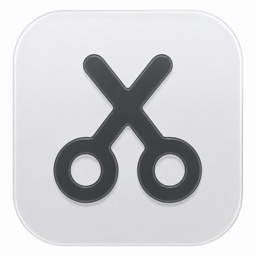

<p align="center">
  
</p>

<h1 align="center">Snip Snap</h1>

<p align="center">
  Save text and files on your Mac. Use them when you need them.
</p>

<p align="center">
  <a href="https://sree.world/snip-snap">Website</a> ·
  <a href="https://github.com/sreejithraman/snip-snap/releases/latest">Latest release</a>
</p>

## Install

```sh
brew install --cask sreejithraman/tap/snip-snap
```

Snip Snap needs macOS 26 or later. Grant Accessibility access when asked so
system-wide capture and Shift shortcuts can work.

## Keep snips ready

- Press Left Shift twice to capture selected text.
- Press Right Shift twice to open your snips.
- Save text and files, sort them into lists, and find them fast.
- Keep up to 100 clipboard items, or pause and clear clipboard history at any
  time.

Everything stays in a small panel where you can edit, copy, or drag snips back
into your work.

## Private on your Mac

Snip Snap stores snips and clipboard history on your Mac. It has no account,
sync, or tracking. Release builds contact the public update feed to check for
new versions.

## Build from source

Use Xcode 26 or later. A clean checkout needs no Apple Developer account:

```sh
./scripts/build.sh
./scripts/test.sh
./scripts/run.sh
```

The Dev app uses ad hoc signing by default. See
[Build and signing setup](docs/building.md) for optional developer signing,
Cloud and device needs, fork identifiers, and official releases.

## License

Snip Snap uses the MIT License. See [LICENSE](LICENSE) and
[THIRD_PARTY_NOTICES.md](THIRD_PARTY_NOTICES.md).
